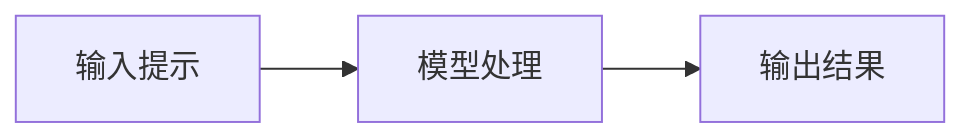
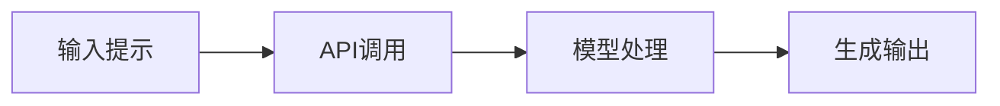
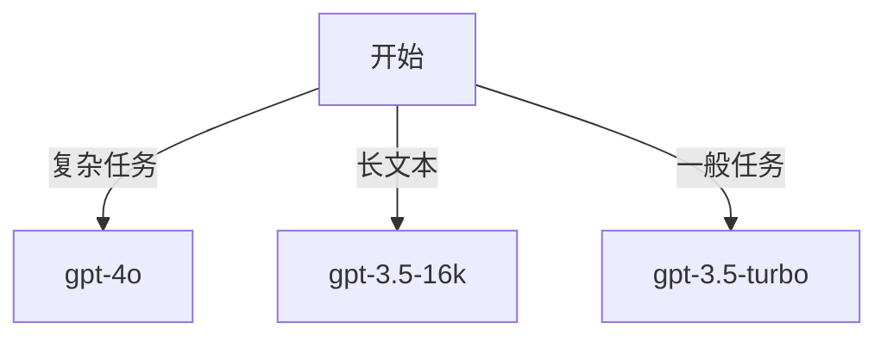
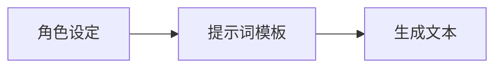
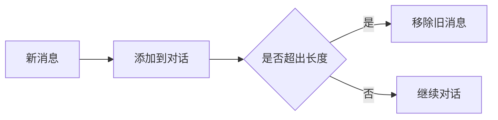

*探索AI的语言创作能力*

# 文本生成：LLM的核心能力

在这个模块中，我们将深入探讨大语言模型（LLM）的文本生成能力。通过本节的学习，你将了解如何利用OpenAI的API进行文本生成，并掌握优化生成效果的技巧。我们将从基础概念开始，逐步深入到高级应用。

## 本节你将学到

- 理解文本生成的基本原理
- 掌握OpenAI API的使用方法
- 学会优化生成效果
- 构建实用的文本生成应用

💡 重点内容：
- 快速入门文本生成
- 选择合适的模型
- 构建有效的提示词
- 管理对话上下文

## 初学者指南：文本生成概念

文本生成是指计算机根据输入的提示或问题，自动生成类似人类书写的文字。这可以包括写诗、回答问题、生成代码等。可以将文本生成比作一个虚拟的写作助手，你给它一个主题或问题，它会根据其学习过的知识来创作内容。

### 分步讲解

- **步骤1**：输入提示——就像你问朋友一个问题。
- **步骤2**：模型处理——计算机“思考”如何回答。
- **步骤3**：输出结果——计算机给出一个完整的回答或创作。

### 使用实例

举例说明，比如你输入“写一首关于春天的诗”，模型可能会生成一段描述春天景色的文字。

### 常见问题解答

解释一些常见的疑问，比如“计算机如何知道怎么回答？”——模型通过大量的文本数据学习语言模式。

### 图示辅助

使用简单的图表展示输入、处理和输出的过程，让初学者更直观地理解。



### 互动练习

提供一些简单的练习，比如输入一个问题，然后观察模型生成的回答，帮助他们理解生成过程。

## 快速入门

在这一部分，我们将通过一个简单的Python代码示例，介绍如何使用OpenAI API进行基础的文本生成。你将学会如何初始化客户端并生成文本。

```python
import openai

# 初始化客户端
client = openai.OpenAI()

# 使用最新gpt-4o模型（纯文本模式）
response = client.chat.completions.create(
    model="gpt-4o",  # 最新多模态模型（也支持纯文本）
    messages=[
        {"role": "user", "content": "写一首关于编程的俳句。"}
    ]
)

print(response.choices[0].message.content)
```

### 图表：API调用流程



## 模型选择

选择合适的模型是生成高质量文本的关键。不同模型有不同的特点和适用场景。我们将通过一个决策树图表来帮助你选择最适合的模型。

| 模型 | 特点 | 适用场景 | 成本 |
|------|------|----------|------|
| gpt-4o-text | 纯文本优化 | 复杂文本任务 | 较高 |
| gpt-3.5-turbo | 性价比优化 | 一般任务 | 适中 |
| gpt-3.5-16k | 支持长文本 | 长文处理 | 适中 |

### 图表：模型选择决策树



## 构建提示词

构建有效的提示词可以显著提升文本生成的效果。在这一部分，我们将探讨如何通过设定角色和使用模板来引导模型生成符合预期的文本。

```python
def create_chat(role_description):
    """创建带角色设定的对话"""
    messages = [
        {
            "role": "system",
            "content": role_description
        }
    ]
    return messages

# 示例：创建一个技术文档写作助手
messages = create_chat("""
你是一个专业的技术文档作者，特点是：
1. 使用清晰简洁的语言
2. 善于举例说明
3. 注重实用性
4. 结构层次分明
""")
```

### 图表：提示词模板结构



## 对话管理

在多轮对话中，维护上下文是确保模型生成相关且连贯响应的关键。我们将介绍如何通过上下文管理来实现这一目标。

```python
class ConversationManager:
    def __init__(self):
        self.messages = []
        self.max_tokens = 4000
    
    def add_message(self, role, content):
        """添加新消息"""
        self.messages.append({
            "role": role,
            "content": content
        })
        self._trim_if_needed()
    
    def _trim_if_needed(self):
        """控制对话长度"""
        while self._estimate_tokens() > self.max_tokens:
            self.messages.pop(1)  # 保留system消息
    
    def _estimate_tokens(self):
        """估算token数量"""
        return sum(len(m["content"].split()) * 1.3 for m in self.messages)
```

### 图表：上下文管理流程



## 实战应用

在这一部分，我们将展示一些实际应用的例子，包括智能写作助手、多语言翻译和结构化数据生成。

### 智能写作助手

```python
class WritingAssistant:
    def __init__(self):
        self.client = openai.OpenAI()
        self.conversation = ConversationManager()
    
    def write_article(self, topic, style="专业", length=1000):
        """生成文章"""
        prompt = create_prompt_template("article").format(
            topic=topic,
            style=style,
            length=length,
            audience="一般读者",
            key_points="主要概念、应用场景、发展趋势"
        )
        
        response = self.client.chat.completions.create(
            model="gpt-4o",
            messages=[
                {"role": "system", "content": "你是一个专业的文章写手"},
                {"role": "user", "content": prompt}
            ]
        )
        return response.choices[0].message.content
```

### 多语言翻译

```python
def translate_text(text, target_lang="英文"):
    """多语言翻译工具"""
    response = client.chat.completions.create(
        model="gpt-3.5-turbo",
        messages=[
            {
                "role": "system",
                "content": f"你是一个专业的翻译专家，擅长将中文翻译成{target_lang}"
            },
            {
                "role": "user",
                "content": f"请将以下内容翻译成{target_lang}：\n{text}"
            }
        ]
    )
    return response.choices[0].message.content
```

### 结构化数据生成

```python
def generate_structured_data(text):
    """生成JSON格式数据"""
    response = client.chat.completions.create(
        model="gpt-4o",
        messages=[
            {"role": "system", "content": "从文本中提取结构化数据"},
            {"role": "user", "content": text}
        ],
        response_format={"type": "json_object"}  # 结构化输出
    )
    return response.choices[0].message.content
```

## 优化技巧

在这一部分，我们将介绍一些优化技巧，包括参数调优和错误处理，以帮助你更好地使用文本生成技术。

### 参数调优

```python
def optimize_parameters():
    """不同场景的参数设置"""
    return {
        "temperature": 0.7,  # 控制生成文本的随机性
        "max_tokens": 150,  # 限制生成文本的长度
        "top_p": 0.9,  # 使用nucleus采样
        "frequency_penalty": 0,  # 控制重复内容的生成
        "presence_penalty": 0  # 控制新主题的引入
    }
```

### 错误处理

```python
def safe_generate(prompt):
    """带错误处理的生成函数"""
    try:
        return client.chat.completions.create(
            model="gpt-4o",
            messages=[{"role": "user", "content": prompt}]
        )
    except Exception as e:
        return f"API错误：{str(e)}"
```

## 最佳实践

最后，我们将分享一些最佳实践，包括内容安全和成本控制，以帮助你在使用文本生成技术时更好地管理资源。

### 内容安全

```python
def check_content_safety(text):
    """内容安全检查"""
    response = client.moderations.create(input=text)
    return response.results[0].flagged
```

### 成本控制

```python
def calculate_cost(model, input_tokens, output_tokens):
    """计算生成成本"""
    cost_per_token = {
        "gpt-4o": 0.03,
        "gpt-3.5-turbo": 0.02
    }
    in_cost = input_tokens * cost_per_token[model]
    out_cost = output_tokens * cost_per_token[model]
    return round(in_cost + out_cost, 4)
```

## 实践练习

通过以下练习，你可以实践所学的知识：

1. 实现一个多语言翻译工具
2. 构建带上下文记忆的对话系统
3. 开发一个自动生成周报的工具
4. 创建内容安全检查机制

## 下一步

接下来，我们将学习代码生成能力，探索AI如何辅助编程。

🚧 本节内容持续完善中...